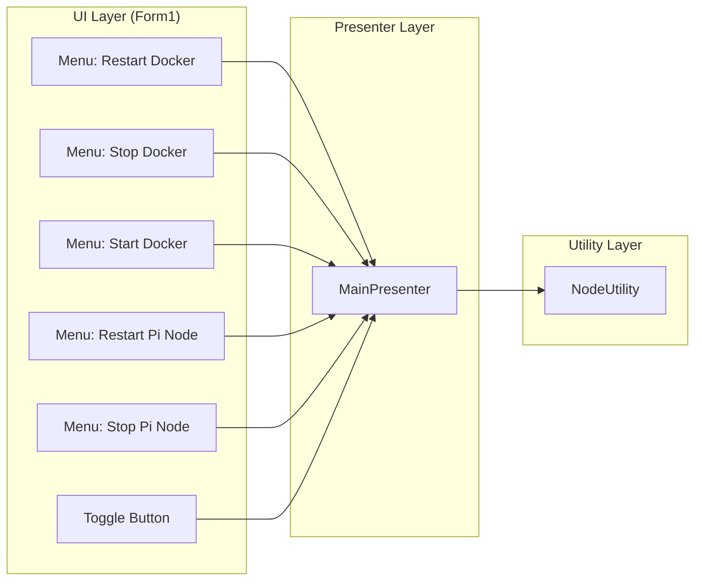

# 시스템 제어 명세서 (Control System Specification)

> **목적:** 본 문서는 Docker 및 Pi Node 제어 기능을 명세합니다. 메뉴에서 구현된 시작/중지/재시작 로직을 재구현할 수 있도록 상세히 기술합니다.

---

## 1. 아키텍처 개요



---

## 2. Docker 제어 시스템

### 2.1. Docker Desktop 시작

**파일:** `MainPresenter.cs` (라인 489-496)

```csharp
private async Task StartDockerAsync()
{
    _view.UpdateSystemStatus("Starting Docker Desktop...", Color.LimeGreen);
    
    // 기본 설치 경로 확인
    if (System.IO.File.Exists(@"C:\Program Files\Docker\Docker\Docker Desktop.exe"))
        System.Diagnostics.Process.Start(@"C:\Program Files\Docker\Docker\Docker Desktop.exe");
    else
        _view.ShowError("Docker Desktop not found in default location.");
}
```

### 2.2. Docker Desktop 중지

**파일:** `MainPresenter.cs` (라인 483-487)

```csharp
private async Task StopDockerAsync()
{
    _view.UpdateSystemStatus("Stopping Docker...", Color.Orange);
    await Task.Run(() => NodeUtility.KillProcessByName("Docker Desktop.exe"));
}
```

**의존 유틸리티:** `NodeUtility.KillProcessByName`

```csharp
// NodeUtility.cs
public static void KillProcessByName(string name)
{
    foreach (var p in Process.GetProcessesByName(name.Replace(".exe", "")))
    {
        try { p.Kill(); } catch { }
    }
}
```

### 2.3. Docker Desktop 재시작

**파일:** `MainPresenter.cs` (라인 474-481)

```csharp
private async Task RestartDockerAsync()
{
    _view.UpdateSystemStatus("Restarting Docker Desktop...", Color.Orange);
    await StopDockerAsync();
    await Task.Delay(3000);  // 안정화 대기
    await StartDockerAsync();
    _view.UpdateSystemStatus("Docker Restarted. Please wait...", Color.LimeGreen);
}
```

---

## 3. Pi Node 제어 시스템

### 3.1. Pi Network 경로 탐지 (Intelligent Search)

**파일:** `MainPresenter.cs` (라인 526-584)

Pi Network 실행 파일 경로를 다음 우선순위로 탐색합니다:

| 순서 | 탐색 위치 | 설명 |
|:---:|:---|:---|
| 0 | `Config.CustomPiAppPath` | 사용자 지정 경로 (캐시) |
| 1 | 레지스트리 | `HKCU\Software\Microsoft\Windows\CurrentVersion\Uninstall\Pi Network` |
| 2 | AppData Programs | `%LOCALAPPDATA%\Programs\*\Pi Network.exe` |
| 3 | Program Files | `C:\Program Files\Pi Network\` |

```csharp
private string GetPiNetworkPath()
{
    // 0. 캐시된 경로 확인
    if (!string.IsNullOrEmpty(NodeUtility.Config.CustomPiAppPath) && 
        System.IO.File.Exists(NodeUtility.Config.CustomPiAppPath))
        return NodeUtility.Config.CustomPiAppPath;

    string foundPath = null;

    // 1. 레지스트리 검색
    try {
        using (var key = Microsoft.Win32.Registry.CurrentUser.OpenSubKey(
            @"Software\Microsoft\Windows\CurrentVersion\Uninstall\Pi Network")) {
            if (key != null) {
                string iconPath = key.GetValue("DisplayIcon") as string;
                if (!string.IsNullOrEmpty(iconPath) && System.IO.File.Exists(iconPath))
                    foundPath = iconPath;
                
                string installLoc = key.GetValue("InstallLocation") as string;
                if (foundPath == null && !string.IsNullOrEmpty(installLoc)) {
                    string exe = System.IO.Path.Combine(installLoc, "Pi Network.exe");
                    if (System.IO.File.Exists(exe)) foundPath = exe;
                }
            }
        }
    } catch { }

    // 2. AppData Programs 지능형 검색
    if (foundPath == null) {
        try {
            string localPrograms = System.IO.Path.Combine(
                Environment.GetFolderPath(Environment.SpecialFolder.LocalApplicationData),
                "Programs");
            if (System.IO.Directory.Exists(localPrograms)) {
                foreach (var dir in System.IO.Directory.GetDirectories(localPrograms)) {
                    string candidate = System.IO.Path.Combine(dir, "Pi Network.exe");
                    if (System.IO.File.Exists(candidate)) { foundPath = candidate; break; }
                }
            }
        } catch { }
    }

    // 3. 글로벌 경로 확인
    if (foundPath == null) {
        string[] paths = {
            System.IO.Path.Combine(Environment.GetFolderPath(
                Environment.SpecialFolder.ProgramFiles), "Pi Network", "Pi Network.exe"),
            @"C:\Program Files (x86)\Pi Network\Pi Network.exe"
        };
        foreach (var p in paths) if (System.IO.File.Exists(p)) { foundPath = p; break; }
    }

    // 발견된 경로 캐시 저장
    if (foundPath != null) {
        NodeUtility.Config.CustomPiAppPath = foundPath;
        NodeUtility.SaveConfig();
    }

    return foundPath;
}
```

### 3.2. Pi Node 시작

**파일:** `MainPresenter.cs` (라인 506-524)

```csharp
private async Task StartPiNodeAsync()
{
    _view.UpdateSystemStatus("Starting Pi Network...", Color.LimeGreen);
    
    string path = GetPiNetworkPath();
    if (!string.IsNullOrEmpty(path) && System.IO.File.Exists(path))
    {
        try {
            System.Diagnostics.Process.Start(path);
            _view.UpdateSystemStatus("Pi Network Started.", Color.LimeGreen);
        } catch (Exception ex) {
            _view.ShowError($"Failed to launch Pi Network: {ex.Message}");
        }
    }
    else {
        _view.ShowError("Pi Network Executable not found anywhere (Registry/Default Paths).");
    }
}
```

### 3.3. Pi Node 중지

**파일:** `MainPresenter.cs` (라인 587-591)

```csharp
private async Task StopPiNodeAsync()
{
    _view.UpdateSystemStatus("Stopping Pi Network...", Color.Orange);
    await Task.Run(() => NodeUtility.KillProcessByName("Pi Network.exe"));
}
```

### 3.4. Pi Node 재시작

**파일:** `MainPresenter.cs` (라인 498-504)

```csharp
private async Task RestartPiNodeAsync()
{
    _view.UpdateSystemStatus("Restarting Pi Network...", Color.Orange);
    await StopPiNodeAsync();
    await Task.Delay(3000);  // 프로세스 안정화 대기
    await StartPiNodeAsync();
}
```

---

## 4. 토글 버튼 로직 (노드 시작/중지)

**파일:** `MainPresenter.cs` (라인 430-453)

```csharp
public async Task ToggleNodeAsync()
{
    bool isRunning = !string.IsNullOrEmpty(_currentMetrics.ActiveContainerName);
    
    if (isRunning)
    {
        await StopPiNodeAsync();
        _view.UpdateToggleButton(false);
    }
    else
    {
        await StartPiNodeAsync();
        _view.UpdateToggleButton(true);
    }
}
```

---

## 5. 관련 파일 맵

| 파일 | 역할 |
|:---|:---|
| `MainPresenter.cs` | Docker/PiNode 제어 메서드 |
| `NodeUtility.cs` | `KillProcessByName`, `RunDockerCommandAsync` |
| `Form1.cs` | 메뉴 이벤트 핸들러 |
| `MonitorConfig.cs` | `CustomPiAppPath` 저장 |

---

## 6. 재구현 시 주의사항

### 6.1. 경로 탐지 순서

반드시 **캐시 → 레지스트리 → AppData → Program Files** 순서를 유지해야 합니다. 순서가 바뀌면 사용자 지정 경로가 무시될 수 있습니다.

### 6.2. 프로세스 종료 후 대기

Docker 및 Pi Node 재시작 시 **최소 3초 대기**가 필요합니다. 즉시 재시작 시 포트 충돌이나 리소스 잠금이 발생할 수 있습니다.

### 6.3. 비동기 처리

모든 제어 메서드는 `async Task`로 구현하여 UI 블로킹을 방지합니다.

---

## 프로젝트 버전 호환성

| 프로젝트 버전 | 본 문서 적용 |
|:---|:---|
| v1.8.26 | ✅ 기본 Docker/PiNode 제어 |
| **v2.0.0** | ✅ 레지스트리 탐색 및 경로 캐싱 개선 |
