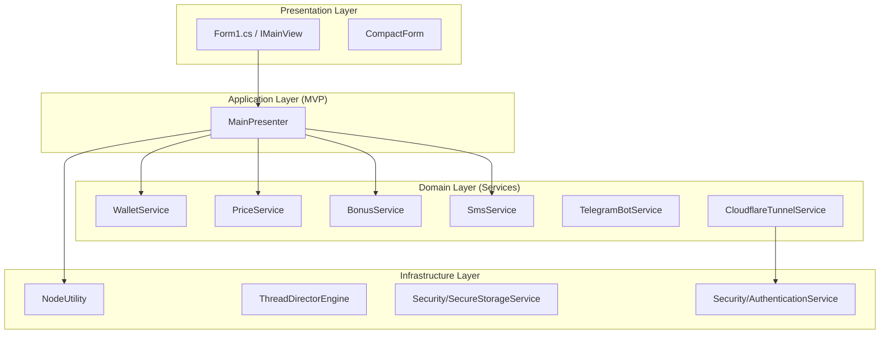

# 핵심 기능 명세서 (Core Features Specification)

> **목적:** 본 문서는 Pi Node Monitor Pro의 핵심 기능들을 명세합니다. 리팩토링 또는 기능 추가 시 참조하여 정합성을 유지합니다.

---

## 1. 아키텍처 개요 (Architecture Overview)



---

## 2. 4-Tier Failover 데이터 수집 파이프라인

### 2.1. 개요
노드 메트릭은 최대 4가지 경로를 통해 수집됩니다. 상위 계층 실패 시 하위 계층으로 자동 전환됩니다.

| Tier | 경로 | 포트 | 데이터 형식 |
|:---:|:---|:---:|:---|
| T1 | Host HTTP (`localhost`) | 31401 | Pi API JSON |
| T2 | Docker Exec (`curl`) | 31401 (컨테이너) | Pi API JSON |
| T3 | Host HTTP (`localhost`) | 31402 | Stellar Core JSON |
| T4 | Docker Exec (`wget`) | 11626 (컨테이너) | Stellar Core JSON |

### 2.2. 코드 참조
**파일:** `MainPresenter.cs`  
**메서드:** `UpdateNodeMetricsFastAsync` (라인 174-239)

```csharp
// Tier 1: Host API
bool success = await TryUpdateFromUrlAsync("http://localhost:31401/node/info");
if (!success) success = await TryUpdateFromUrlAsync("http://127.0.0.1:31401/node/info");

// Tier 2: Docker Exec
if (!success && !string.IsNullOrEmpty(_currentMetrics.ActiveContainerName))
{
    string json = await NodeUtility.RunDockerCommandAsync(
        $"exec {_currentMetrics.ActiveContainerName} curl -s http://localhost:31401/node/info");
    success = ParseNodeInfoJson(json, false);
}

// Tier 3/4: Stellar Failover
if (!success) { /* ... Stellar Core fallback ... */ }
```

### 2.3. 불변 규칙 (Invariants)
- **타임아웃:** 각 HTTP 요청은 3초 내에 완료되어야 함
- **폴링 주기:** Fast 메트릭은 3초, Medium 메트릭은 10초, Slow 메트릭은 60초
- **순서 보장:** 반드시 T1 → T2 → T3 → T4 순서로 시도

---

## 3. 폴링 주기 체계 (Polling Frequency System)

### 3.1. 메트릭 분류

| 분류 | 주기 | 수집 항목 | 메서드 |
|:---|:---:|:---|:---|
| **Fast** | 3초 | 블록 번호, 피어 수, 상태 | `UpdateNodeMetricsFastAsync` |
| **Medium** | 10초 | Docker 상태, CPU/RAM 사용량 | `UpdateNodeMetricsMediumAsync` |
| **Slow** | 60초 | 포트 개방 상태, 외부 IP | `UpdateNodeMetricsSlowAsync` |

### 3.2. 코드 참조
**파일:** `MainPresenter.cs`  
**메서드:** `OnTimerTick` (라인 137-170)

```csharp
private async void OnTimerTick(object sender, EventArgs e)
{
    _tickCount++;
    // Fast: 매 틱 (3초)
    await UpdateNodeMetricsFastAsync();
    
    // Medium: 매 3틱 (약 10초)
    if (_tickCount % 3 == 0) await UpdateNodeMetricsMediumAsync();
    
    // Slow: 매 20틱 (약 60초)
    if (_tickCount % 20 == 0) await UpdateNodeMetricsSlowAsync();
}
```

---

## 4. 보안 아키텍처 (Security Architecture)

### 4.1. DPAPI 암호화 (`SecureStorageService`)

| 항목 | 설명 |
|:---|:---|
| **범위** | `DataProtectionScope.CurrentUser` |
| **엔트로피** | `PiNodeMonitorPro_v2.0_Security` |
| **용도** | API 키, 토큰, 민감 설정 저장 |

**파일:** `Services/Security/SecureStorageService.cs`

### 4.2. 원격 인증 (`AuthenticationService`)

| 항목 | 값 |
|:---|:---|
| **PIN 길이** | 6자 |
| **문자셋** | `ABCDEFGHJKLMNPQRSTUVWXYZ23456789` (혼동 문자 제외) |
| **실패 허용** | 5회 |
| **차단 시간** | 15분 |

**파일:** `Services/Security/AuthenticationService.cs`

---

## 5. 외부 연동 서비스 (External Services)

### 5.1. Cloudflare Tunnel (`CloudflareTunnelService`)
- **역할:** 외부에서 안전하게 모니터에 접근할 수 있는 터널 제공
- **의존성:** `cloudflared.exe`
- **파일:** `Services/CloudflareTunnelService.cs`

### 5.2. Telegram 알림 (`TelegramBotService`)
- **역할:** 노드 상태 변경 시 텔레그램 메시지 전송
- **파일:** `Services/TelegramBotService.cs`

### 5.3. SMS 알림 (`SmsService`)
- **역할:** 긴급 상황 시 SMS 전송 (Twilio/Vonage/직접 모뎀)
- **파일:** `Services/Sms/SmsService.cs`

---

## 6. 관련 파일 맵

| 파일 | 역할 |
|:---|:---|
| `MainPresenter.cs` | MVP Presenter, 메트릭 수집 오케스트레이션 |
| `NodeUtility.cs` | Docker/WSL 명령 실행, 네트워크 분석 |
| `WalletService.cs` | 지갑 주소/잔액 조회 |
| `PriceService.cs` | Pi 코인 가격 조회 |
| `BonusService.cs` | 노드 보너스 계산 |
| `ThreadDirectorEngine.cs` | 비동기 작업 스케줄링 |

---

## 버전 이력

| 버전 | 날짜 | 변경 내용 |
|:---|:---|:---|
| 1.0 | 2026-01-28 | 초기 명세 작성 |

---

## 프로젝트 버전 호환성

| 프로젝트 버전 | 본 문서 적용 |
|:---|:---|
| v1.8.26 | ⚠️ 일부 보안 기능 미구현 |
| **v2.0.0** | ✅ DPAPI, Rate-Limited Auth 등 모든 보안 기능 포함 |

