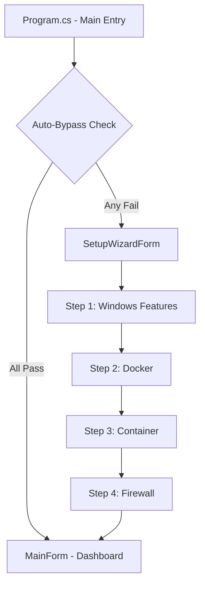

# 환경 검사 시스템 명세서 (Environment Check Specification)

> **목적:** 본 문서는 Pi Node Monitor의 환경 검사 시스템을 명세합니다. 다른 프로젝트에서 유사한 Windows 기능 검사 및 Docker 환경 검증을 구현할 때 참조할 수 있습니다.

---

## 1. 아키텍처 개요



---

## 2. 4-Step 환경 검사 시스템

### 2.1. Step 1: Windows 기능 활성화 검사

| 검사 대상 | 메서드 | 설명 |
|:---|:---|:---|
| Virtual Machine Platform | `IsWindowsFeatureEnabledAsync("VirtualMachinePlatform")` | Hyper-V 기반 가상화 |
| WSL | `IsWindowsFeatureEnabledAsync("Microsoft-Windows-Subsystem-Linux")` | Linux 서브시스템 |
| WSL 설치 여부 | `IsWslInstalledAsync()` | `wsl.exe` 존재 확인 |

**코드 참조:** `SetupWizardForm.cs` (라인 136-159)

```csharp
bool vmp = await NodeUtility.IsWindowsFeatureEnabledAsync("VirtualMachinePlatform");
bool wsl = await NodeUtility.IsWindowsFeatureEnabledAsync("Microsoft-Windows-Subsystem-Linux");
bool wslInstalled = await NodeUtility.IsWslInstalledAsync();

if (!vmp || !wsl) {
    UpdateStepUI(false, "Features Missing", "...", "Enable Features");
} else if (!wslInstalled) {
    UpdateStepUI(false, "WSL Update Needed", "...", "Update WSL2");
} else {
    UpdateStepUI(true, "Environment Ready!", "...", "");
    await Task.Delay(500);
    LoadStep(2); // Auto-advance
}
```

### 2.2. Step 2: Docker 실행 상태 검사

| 검사 대상 | 메서드 | 설명 |
|:---|:---|:---|
| Docker Desktop 프로세스 | `IsDockerRunningAsync()` | 프로세스 존재 확인 |

**코드 참조:** `NodeUtility.cs` (라인 168)

```csharp
public static async Task<bool> IsDockerRunningAsync() =>
    Process.GetProcessesByName("Docker Desktop").Length > 0 ||
    Process.GetProcessesByName("docker").Length > 0;
```

### 2.3. Step 3: 노드 컨테이너 존재 검사

| 검사 대상 | 메서드 | 우선순위 |
|:---|:---|:---|
| pi-consensus | `IsContainerExistAsync("pi-consensus")` | 1순위 |
| testnet2 | `IsContainerExistAsync("testnet2")` | 2순위 |

**코드 참조:** `SetupWizardForm.cs` (라인 180-196)

```csharp
bool containerOk = false;
if (await NodeUtility.IsContainerExistAsync("pi-consensus")) {
    containerOk = true;
    NodeUtility.CurrentContainerName = "pi-consensus";
} else if (await NodeUtility.IsContainerExistAsync("testnet2")) {
    containerOk = true;
    NodeUtility.CurrentContainerName = "testnet2";
}
```

### 2.4. Step 4: 방화벽 포트 검사

| 검사 포트 | 용도 |
|:---|:---|
| 31401 | Pi Node API |
| 31402 | Stellar Core HTTP |
| 31403 | 예비 포트 |

**코드 참조:** `NodeUtility.cs` (라인 176-182)

```csharp
public static async Task<bool> IsFirewallRulePresentAsync()
{
    string output = await RunWslCommandAsync("-d docker-desktop-data -- netstat -an") ?? "";
    return output.Contains(":31401") || output.Contains(":31402") || output.Contains(":31403");
}
```

---

## 3. 핵심 유틸리티 메서드

### 3.1. Windows 기능 활성화 명령

```csharp
// NodeUtility.cs - 라인 173
public static async Task EnableWindowsFeaturesAsync() =>
    await RunCommandAsync("powershell",
        "-NoProfile -Command \"Enable-WindowsOptionalFeature -Online -FeatureName VirtualMachinePlatform -NoRestart; " +
        "Enable-WindowsOptionalFeature -Online -FeatureName Microsoft-Windows-Subsystem-Linux -NoRestart\"",
        true); // true = Run as Admin
```

### 3.2. WSL 업데이트 명령

```csharp
// NodeUtility.cs - 라인 174
public static async Task UpdateWslAsync() =>
    await RunCommandAsync("wsl.exe", "--update", true);
```

### 3.3. Docker 컨테이너 존재 확인

```csharp
// NodeUtility.cs - 라인 186
public static async Task<bool> IsContainerExistAsync(string n) =>
    (await RunDockerCommandAsync($"ps -a --filter name={n} --format \"{{{{.Names}}}}\"") ?? "").Contains(n);
```

---

## 4. Auto-Bypass 로직 (Program.cs)

모든 환경 검사가 통과하면 Setup Wizard를 건너뛰고 바로 대시보드로 진입합니다.

```csharp
// Program.cs - 라인 54-65
var vmpTask = NodeUtility.IsWindowsFeatureEnabledAsync("VirtualMachinePlatform");
var wslTask = NodeUtility.IsWindowsFeatureEnabledAsync("Microsoft-Windows-Subsystem-Linux");
var dockerTask = NodeUtility.IsDockerRunningAsync();

await Task.WhenAll(vmpTask, wslTask, dockerTask);

bool canAutoBypass = vmpTask.Result && wslTask.Result && dockerTask.Result;
if (canAutoBypass)
{
    Application.Run(new Form1()); // Direct to Dashboard
}
else
{
    using (var wizard = new SetupWizardForm())
    {
        if (wizard.ShowDialog() == DialogResult.OK)
            Application.Run(new Form1());
    }
}
```

---

## 5. 관련 파일 맵

| 파일 | 역할 |
|:---|:---|
| `Program.cs` | 진입점, Auto-Bypass 판정 |
| `SetupWizardForm.cs` | 4-Step 마법사 UI 및 로직 |
| `NodeUtility.cs` | 환경 검사 헬퍼 메서드 |
| `DiagnosticsForm.cs` | 상세 진단 폼 (선택적) |

---

## 6. 재구현 가이드라인

### 6.1. 다른 프로젝트에서 사용 시

1. **NodeUtility 복사**: 환경 검사 관련 메서드들을 `NodeUtility.cs`에서 추출
2. **프로세스 이름 변경**: `Docker Desktop`, `docker` 등을 대상 앱에 맞게 수정
3. **포트 번호 변경**: 31401-31403을 대상 앱의 포트로 수정

### 6.2. 주의사항

- **관리자 권한**: `EnableWindowsFeaturesAsync`는 관리자 권한 필요
- **타임아웃**: Docker 명령은 3초 타임아웃 적용 권장
- **비동기 처리**: UI 블로킹 방지를 위해 모든 검사는 `async/await` 패턴 사용

---

## 프로젝트 버전 호환성

| 프로젝트 버전 | 본 문서 적용 |
|:---|:---|
| v1.8.26 | ✅ 기본 환경 검사 구현 |
| **v2.0.0** | ✅ Auto-Bypass 및 캐싱 개선 반영 |
