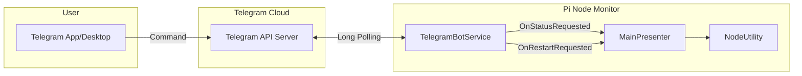

# 텔레그램 봇 연동 명세서 (Telegram Bot Integration Specification)

> **목적:** 본 문서는 Pi Node Monitor의 텔레그램 봇 연동 기능을 명세합니다. 다른 프로젝트에서 유사한 텔레그램 원격 제어 기능을 구현할 때 참조할 수 있습니다.

---

## 1. 아키텍처 개요



---

## 2. 핵심 구성요소

### 2.1. 클래스 구조

**파일:** `Services/TelegramBotService.cs` (161라인)

| 필드/속성 | 타입 | 설명 |
|:---|:---|:---|
| `_token` | `string` | 봇 API 토큰 |
| `_allowedChatId` | `string` | 허용된 채팅 ID (보안용) |
| `_client` | `HttpClient` | HTTP 통신 클라이언트 |
| `_lastUpdateId` | `long` | 마지막 처리된 업데이트 ID |
| `IsRunning` | `bool` | 서비스 실행 상태 |

### 2.2. 이벤트 시스템

```csharp
// 외부 모듈과의 느슨한 결합을 위한 이벤트 패턴
public event Func<string> OnStatusRequested;    // 상태 요청 시 호출
public event Action OnRestartRequested;         // 재시작 요청 시 호출
```

---

## 3. Long Polling 메커니즘

### 3.1. 개요
Webhook 대신 **Long Polling** 방식을 사용하여 별도의 공인 IP나 HTTPS 인증서 없이 동작합니다.

### 3.2. 폴링 루프

**코드 참조:** 라인 47-80

```csharp
private async Task PollingLoop(CancellationToken token)
{
    while (!token.IsCancellationRequested)
    {
        try
        {
            // offset 파라미터로 이미 처리한 메시지 제외
            string url = string.Format(
                "https://api.telegram.org/bot{0}/getUpdates?offset={1}&timeout=10",
                _token, _lastUpdateId + 1);
            
            var response = await _client.GetStringAsync(url);
            var updates = JsonConvert.DeserializeObject<TelegramUpdateResponse>(response);
            
            if (updates != null && updates.Result != null)
            {
                foreach (var update in updates.Result)
                {
                    _lastUpdateId = update.UpdateId;
                    // 비동기로 메시지 처리 (폴링 루프 블로킹 방지)
                    _ = Task.Run(async () => await ProcessMessageAsync(update.Message));
                }
            }
        }
        catch (TaskCanceledException) { break; }
        catch (HttpRequestException ex)
        {
            // 네트워크 오류 시 10초 후 재시도
            Debug.WriteLine($"[TelegramBot] Network error: {ex.Message}. Retrying in 10s...");
            try { await Task.Delay(10000, token); } catch { break; }
        }
        catch (Exception ex)
        {
            // 기타 오류 시 5초 후 재시도
            Debug.WriteLine($"[TelegramBot] Critical Error: {ex.Message}");
            try { await Task.Delay(5000, token); } catch { break; }
        }
    }
}
```

### 3.3. 주요 설계 결정

| 항목 | 값 | 이유 |
|:---|:---|:---|
| **Polling Timeout** | 10초 | Telegram API 권장값 (10-60초) |
| **HTTP Timeout** | 30초 | 네트워크 지연 허용 |
| **네트워크 오류 재시도** | 10초 | 일시적 네트워크 문제 대응 |
| **기타 오류 재시도** | 5초 | 빠른 복구 시도 |

---

## 4. 명령어 처리 시스템

### 4.1. 지원 명령어

| 명령어 | 응답 | 설명 |
|:---|:---|:---|
| `/start` `/help` | 도움말 메시지 | 봇 사용법 안내 |
| `/status` | 노드 상태 정보 | `OnStatusRequested` 이벤트 호출 |
| `/reboot` | 재시작 확인 메시지 | `OnRestartRequested` 이벤트 호출 |
| `/ping` | `Pong! 🏓 I am alive.` | 연결 상태 확인 |

### 4.2. 명령어 처리 코드

**코드 참조:** 라인 82-120

```csharp
private async Task ProcessMessageAsync(TelegramMessage msg)
{
    try
    {
        if (msg == null || msg.Text == null) return;
        
        // 보안: 허용된 채팅 ID만 처리
        if (msg.Chat.Id.ToString() != _allowedChatId) return;

        string text = msg.Text.Trim().ToLower();
        string reply = "";

        if (text == "/start" || text == "/help")
        {
            reply = "🤖 **Pi Node Monitor Bot**\n\nCommand List:\n" +
                    "✅ `/status` - Check Node Health\n" +
                    "🔄 `/reboot` - Restart Node Container\n" +
                    "👋 `/ping` - Check Connection";
        }
        else if (text == "/status")
        {
            reply = OnStatusRequested != null ? OnStatusRequested() : "No status available.";
        }
        else if (text == "/reboot")
        {
            if (OnRestartRequested != null) OnRestartRequested();
            reply = "🔄 Reboot command received. Attempting to restart container...";
        }
        else if (text == "/ping")
        {
            reply = "Pong! 🏓 I am alive.";
        }
        else
        {
            return; // 알 수 없는 명령은 무시
        }

        if (!string.IsNullOrEmpty(reply))
        {
            await SendMessageAsync(msg.Chat.Id.ToString(), reply);
        }
    }
    catch (Exception ex) { Debug.WriteLine($"[TelegramBot] ProcessMessageAsync error: {ex.Message}"); }
}
```

---

## 5. 메시지 전송

### 5.1. 전송 메서드

**코드 참조:** 라인 122-130

```csharp
public async Task SendMessageAsync(string chatId, string text)
{
    try
    {
        string url = string.Format(
            "https://api.telegram.org/bot{0}/sendMessage?chat_id={1}&text={2}&parse_mode=Markdown",
            _token, chatId, Uri.EscapeDataString(text));
        await _client.GetAsync(url);
    }
    catch (Exception ex) { Debug.WriteLine($"[TelegramBot] SendMessage error: {ex.Message}"); }
}
```

### 5.2. Markdown 지원
`parse_mode=Markdown` 파라미터를 사용하여 **굵은 글씨**, `코드` 등 서식을 지원합니다.

---

## 6. 서비스 생명주기

### 6.1. 시작

```csharp
public void Start(string token, string chatId)
{
    if (IsRunning) Stop();
    
    _token = token;
    _allowedChatId = chatId;
    _cts = new CancellationTokenSource();
    IsRunning = true;

    Task.Run(() => PollingLoop(_cts.Token));
}
```

### 6.2. 중지

```csharp
public void Stop()
{
    if (_cts != null) _cts.Cancel();
    IsRunning = false;
}
```

---

## 7. JSON 역직렬화 모델

```csharp
public class TelegramUpdateResponse
{
    [JsonProperty("result")]
    public List<TelegramUpdate> Result { get; set; }
}

public class TelegramUpdate
{
    [JsonProperty("update_id")]
    public long UpdateId { get; set; }
    [JsonProperty("message")]
    public TelegramMessage Message { get; set; }
}

public class TelegramMessage
{
    [JsonProperty("text")]
    public string Text { get; set; }
    [JsonProperty("chat")]
    public TelegramChat Chat { get; set; }
}

public class TelegramChat
{
    [JsonProperty("id")]
    public long Id { get; set; }
}
```

---

## 8. 통합 방법

### 8.1. MainPresenter에서 이벤트 연결

```csharp
// MainPresenter.cs 예시
_telegramBot = new TelegramBotService();

// 상태 요청 이벤트 핸들러 등록
_telegramBot.OnStatusRequested += () => 
{
    return $"📊 Node Status\n" +
           $"Block: {_currentMetrics.LocalBlockNum}\n" +
           $"Peers: In={_currentMetrics.IncomingConnections}, Out={_currentMetrics.OutgoingConnections}\n" +
           $"State: {_currentMetrics.ConsensusState}";
};

// 재시작 요청 이벤트 핸들러 등록
_telegramBot.OnRestartRequested += async () =>
{
    await RestartPiNodeAsync();
};

// 봇 시작
_telegramBot.Start("YOUR_BOT_TOKEN", "YOUR_CHAT_ID");
```

---

## 9. 보안 고려사항

| 항목 | 구현 | 설명 |
|:---|:---|:---|
| **Chat ID 검증** | `msg.Chat.Id.ToString() != _allowedChatId` | 허용된 사용자만 명령 실행 |
| **토큰 저장** | `SecureStorageService` 권장 | DPAPI 암호화 저장 |
| **명령 제한** | 알 수 없는 명령 무시 | 부적절한 입력 차단 |

---

## 10. 관련 파일

| 파일 | 역할 |
|:---|:---|
| `Services/TelegramBotService.cs` | 텔레그램 봇 핵심 로직 |
| `MainPresenter.cs` | 이벤트 핸들러 연결 |
| `MonitorConfig.cs` | 토큰/ChatID 설정 저장 |
| `SecureStorageService.cs` | 토큰 암호화 저장 |

---

## 11. 텔레그램 봇 생성 가이드

1. **@BotFather**에게 `/newbot` 명령으로 봇 생성
2. 발급받은 **토큰**을 앱 설정에 입력
3. 봇과 대화를 시작하고 https://api.telegram.org/bot{TOKEN}/getUpdates 로 **Chat ID** 확인
4. 앱 설정에 Chat ID 입력

---

## 프로젝트 버전 호환성

| 프로젝트 버전 | 본 문서 적용 |
|:---|:---|
| v1.8.26 | ✅ 기본 텔레그램 봇 기능 |
| **v2.0.0** | ✅ 이벤트 기반 느슨한 결합 구조 |
