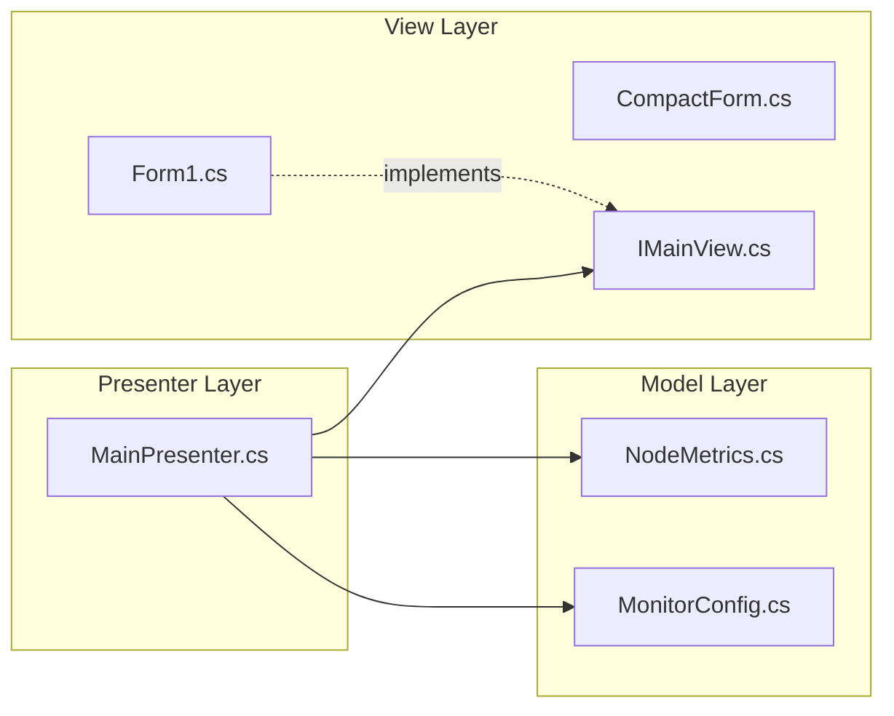

# UI 아키텍처 명세서 (UI Architecture Specification)

> **목적:** 본 문서는 Pi Node Monitor Pro의 UI 구조와 MVP 패턴 적용을 명세합니다.

---

## 1. MVP 패턴 구조

### 1.1. 계층 다이어그램



### 1.2. 역할 분리

| 계층 | 파일 | 역할 |
|:---|:---|:---|
| **View** | `Form1.cs`, `IMainView.cs` | UI 컨트롤 표시, 사용자 이벤트 발생 |
| **Presenter** | `MainPresenter.cs` | 비즈니스 로직, 서비스 호출, 뷰 업데이트 |
| **Model** | `NodeMetrics.cs`, `MonitorConfig.cs` | 순수 데이터 객체 |

---

## 2. 주요 폼 구조

### 2.1. Main Form (`Form1.cs`)

| 영역 | 컨트롤 | 용도 |
|:---|:---|:---|
| **Header** | `lblStatus`, `lblNodeStatus` | 노드 상태 표시 |
| **Metrics Panel** | `lblLocalBlock`, `lblPeers`, `lblCPU` | 실시간 메트릭 |
| **Control Panel** | `btnToggle`, `btnCompact`, `btnTunnel` | 주요 액션 버튼 |
| **Status Bar** | `statusStrip` | 연결 상태, 버전 정보 |

### 2.2. Compact Form (`CompactForm.cs`)

| 특성 | 값 |
|:---|:---|
| **크기** | 300 x 100 px |
| **TopMost** | `true` |
| **FormBorderStyle** | `None` |
| **용도** | 최소화된 오버레이 뷰 |

---

## 3. 테마 시스템

### 3.1. 색상 팔레트

| 모드 | 배경 | 전경 | 강조 |
|:---|:---|:---|:---|
| **Light** | `#FFFFFF` | `#333333` | `#6A5ACD` |
| **Dark** | `#1E1E2E` | `#CDD6F4` | `#CBA6F7` |

### 3.2. 코드 참조

```csharp
// Form1.cs - ApplyTheme 메서드
public void ApplyTheme(bool isDark)
{
    this.BackColor = isDark ? Color.FromArgb(30, 30, 46) : Color.White;
    lblTitle.ForeColor = isDark ? Color.FromArgb(205, 214, 244) : Color.Black;
    // ...
}
```

---

## 4. 데이터 바인딩 흐름

### 4.1. Presenter → View 업데이트

```csharp
// MainPresenter.cs
_view.UpdateNodeMetrics(_currentMetrics);
_view.UpdateWallet(walletData);
_view.UpdatePrice(priceData);

// IMainView.cs (인터페이스)
void UpdateNodeMetrics(NodeMetrics metrics);
void UpdateWallet(WalletData data);
void UpdatePrice(PriceData data);
```

### 4.2. View → Presenter 이벤트

```csharp
// Form1.cs
private void btnToggle_Click(object sender, EventArgs e)
{
    _presenter.ToggleNodeAsync();
}

private void btnCompact_Click(object sender, EventArgs e)
{
    _presenter.ToggleCompactMode();
}
```

---

## 5. 동시성 처리

### 5.1. UI Thread 안전성

| 원칙 | 구현 |
|:---|:---|
| **Invoke 패턴** | 모든 UI 업데이트는 `Invoke`/`BeginInvoke` 사용 |
| **async/await** | Presenter의 비동기 메서드에서 `ConfigureAwait(true)` |

```csharp
// Form1.cs - Thread-safe UI update
public void UpdateNodeMetrics(NodeMetrics m)
{
    if (InvokeRequired)
    {
        BeginInvoke(new Action(() => UpdateNodeMetrics(m)));
        return;
    }
    lblLocalBlock.Text = m.LocalBlockNum;
    // ...
}
```

---

## 6. 관련 파일 맵

| 파일 | 위치 | 역할 |
|:---|:---|:---|
| `Form1.cs` | Root | 메인 윈도우 |
| `Form1.Designer.cs` | Root | UI 컨트롤 정의 |
| `CompactForm.cs` | Root | 컴팩트 오버레이 |
| `IMainView.cs` | `Core/MVP/Views/` | View 인터페이스 |
| `MainPresenter.cs` | `Core/MVP/Presenters/` | Presenter |
| `NodeMetrics.cs` | `Core/MVP/Models/` | 노드 메트릭 모델 |
| `MonitorConfig.cs` | `Core/MVP/Models/` | 설정 모델 |

---

## 버전 이력

| 버전 | 날짜 | 변경 내용 |
|:---|:---|:---|
| 1.0 | 2026-01-28 | 초기 명세 작성 |

---

## 프로젝트 버전 호환성

| 프로젝트 버전 | 본 문서 적용 |
|:---|:---|
| v1.8.26 | ✅ MVP 패턴 및 기본 UI 구조 동일 |
| **v2.0.0** | ✅ 테마 시스템 및 동시성 처리 개선 반영 |

